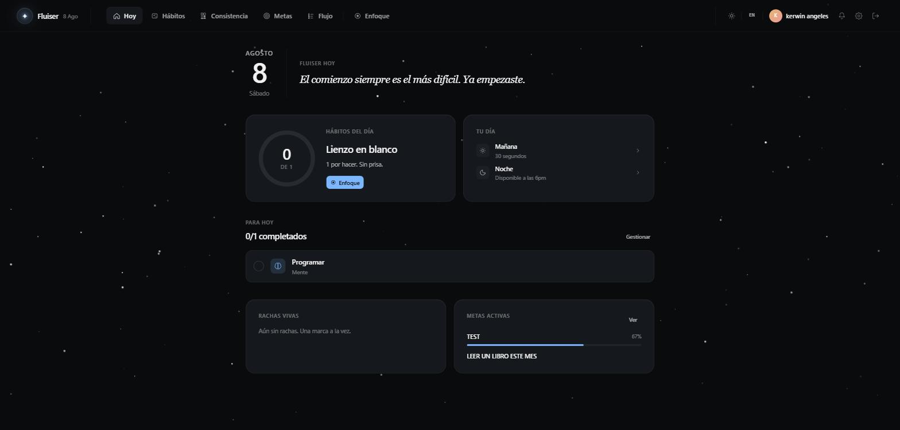
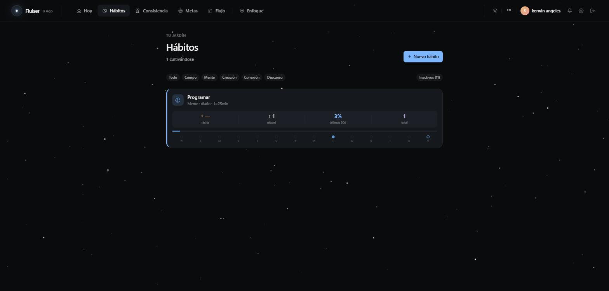
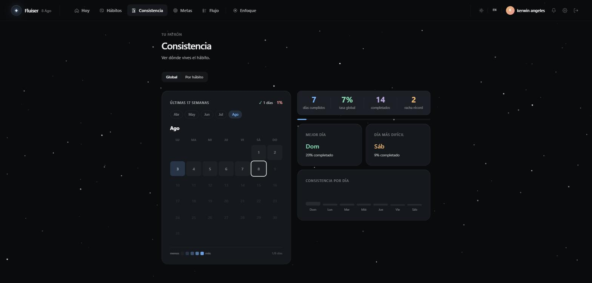
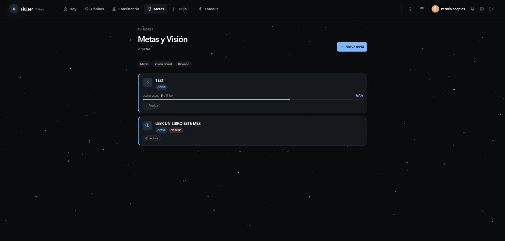
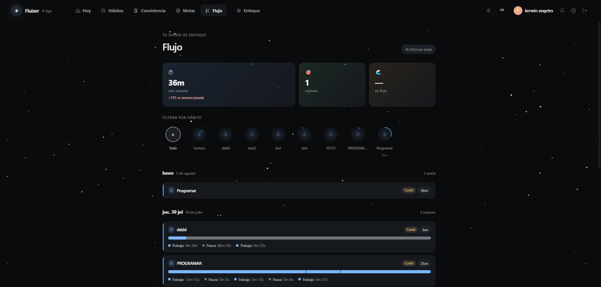
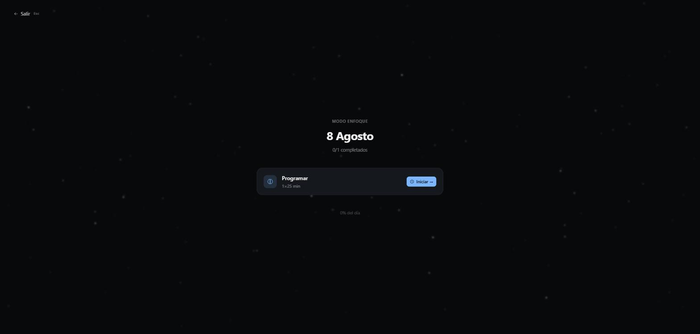

# Fluiser

**Hábitos, foco y metas en un solo lugar.**

Fluiser es una PWA para construir hábitos, mantener el foco con sesiones de trabajo y alcanzar tus metas, todo desde una misma app. En vez de repartir la productividad entre un tracker de hábitos, un temporizador pomodoro y una app de objetivos, Fluiser conecta las tres piezas: cada hábito puede vincularse a una meta, cada sesión de enfoque alimenta tu racha, y tu consistencia se visualiza en un solo mapa de calor.

🔗 [fluiser.gelesx.com](https://fluiser.gelesx.com/)

## Funcionalidades

- **Hoy** — Dashboard diario con tus hábitos pendientes, tu jornada (mañana/noche) y el progreso de tus metas activas.
- **Hábitos** — Crea y da seguimiento a hábitos por categoría (Cuerpo, Mente, Creación, Conexión, Descanso), con racha, récord y cumplimiento de los últimos 30 días.
- **Consistencia** — Mapa de calor semanal/mensual de tu constancia, con mejor día, día más difícil y tasa global.
- **Metas y Visión** — Metas ligadas directamente a hábitos (sin marcos tipo OKR), con Vision Board y Revisión Semanal guiada.
- **Flujo** — Historial de tus sesiones de enfoque: tiempo trabajado, pausas y duración por hábito.
- **Enfoque** — Modo de trabajo a pantalla completa con temporizador tipo pomodoro por hábito.
- **PWA** — Instalable, con soporte offline y notificaciones push.

## Capturas

| Hoy | Hábitos |
|---|---|
|  |  |

| Consistencia | Metas y Visión |
|---|---|
|  |  |

| Flujo | Enfoque |
|---|---|
|  |  |
